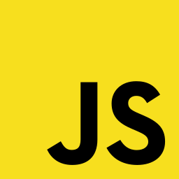
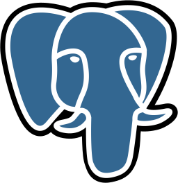
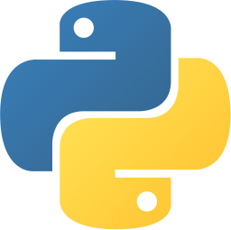
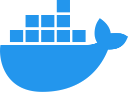
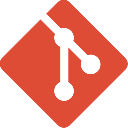

# Hi :wave:, I am Dev

<!-- Showcase -->
<section align="left" style="margin: 16px 0">
  
  
</section>

<!-- About Me -->
<section align="left" style="margin: 16px 0">
  <h2 style="margin: 4px 0">
    ABOUT ME
  </h2>

  - :computer: Software Developer
  - :earth_asia: Manipur, India
  - 👨‍🎓 Graduated (2019) - :link: [NIT Manipur](https://www.nitmanipur.ac.in/)
  - :gear: Currently building [**Arcanaa Technologies**](https://www.arcanaa.com/) (Co Founder)
  - :eyes: Interested in science & tech, coding, music
  - :heart: Open to collaborations and suggestions to improve my skills
</section>

<!-- Projects -->
<section align="left" style="margin: 16px 0;">
  <h2 style="margin: 4px 0">
    PROJECTS
  </h2>

  - <b style="font-size: 17px;">Imphal Free Press</b> - :link: [ifp.co.in](https://www.ifp.co.in)
    :heavy_check_mark: Django, Next, Tailwind, Docker, GitLab CI/CD, Terraform, AWS ECS
    :heavy_check_mark: Team of 2 including myself
  - <b style="font-size: 17px;">Dr. Vidyabati Devi portfolio</b> - :link: [vidyarajkumari.com](http://www.vidyarajkumari.com)
    :heavy_check_mark: Django, React, Tailwind, GitHub, AWS EC2
    :heavy_check_mark: Team of 2 including myself
  - <b style="font-size: 17px;">Falcon Aviation and Hospitality Institute</b> - :link: [falconinstitute.in](https://www.falconinstitute.in/)
    :heavy_check_mark: Astro, Tailwind CSS, Gitlab
  - <b style="font-size: 17px;">Edutruth KOTA Coaching Classes</b> - :link: [edutruth.in](https://www.edutruth.in/)
    :heavy_check_mark: Next (static), Tailwind CSS, Gitlab
  - <b style="font-size: 17px;">Performance analysis of a feature reduction based intrusion detection system with SVM & ensemble learning algorithms</b>
    :heavy_check_mark: Post graduation project (2019)
</section>

<!-- Tech Stack -->
<section align="left" style="margin: 16px 0">
  <h2 style="margin: 4px 0">
    TECH STACK
  </h2>
  

     
     
     
     
     
    
     
     
     
     
     
     
  

</section>

<!-- Socials -->
<section align="left" style="margin: 16px 0">
  <h2 style="margin: 4px 0">
    CONNECT
  </h2>
  

     
     
    
  

</section>
